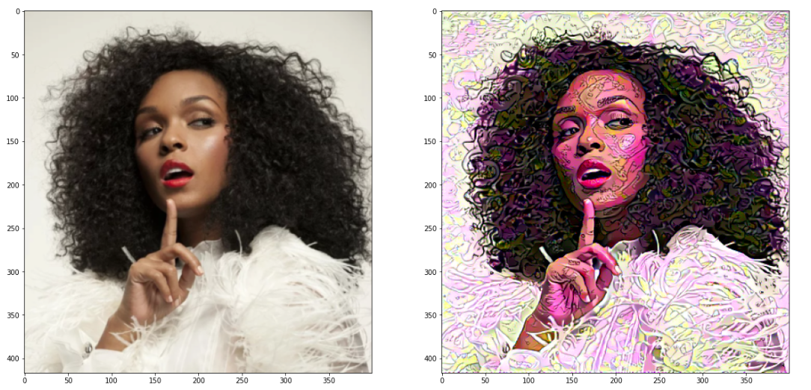

# image_style_transfer
 Extract style and content features from images, using a pre-trained network.

**Paper :** [Image Style Transfer Using Convolutional Neural Networks](https://www.cv-foundation.org/openaccess/content_cvpr_2016/papers/Gatys_Image_Style_Transfer_CVPR_2016_paper.pdf)

**Output:**

